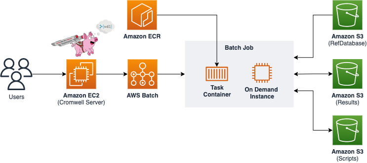

# One-click deployment of genomic workflow with cromwell

This project implements a bioinformatics analysis solution based on Cromwell and AWS Batch, addressing the challenges of integrating Cromwell with AWS Batch. By mounting Amazon S3 storage into Docker containers, it achieves efficient reference data storage, improving overall throughput and cost-effectiveness.

## Project Overview
### One-click deployment of genomics solutions on AWS - Cromwell + AWS Batch
- Utilizes Cromwell as the workflow manager, orchestrating bioinformatics analysis pipelines
- Leverages AWS Batch for scalable compute resources to run analysis tasks
- Stores reference databases on Amazon S3, mounted as Docker volumes on compute nodes, the path is /data/ref/
- Initialize the Cromwell backend configuration file to work with AWS Batch, and initialize the test scripts
- Builds cloud resources using AWS CDK, enabling Infrastructure as Code (IaC)

## Solution Architecture
                  
<br/>



## Prerequisites

- AWS account and appropriate IAM permissions
- Python 3.7 or higher
- AWS CDK toolchain

## Quick Start

1. Clone the project repository:

```
git clone https://github.com/zane529/aws-cdk-cromwell-batch
cd aws-cdk-cromwell-batch
```

2. Create and activate a Python virtual environment:

```
python3 -m venv .venv
source .venv/bin/activate
```

3. Install dependencies:

```
pip install -r requirements.txt
```

4. Deploy the infrastructure using AWS CDK:

```
export CDK_DEFAULT_ACCOUNT=xxxxxxxx
export CDK_DEFAULT_REGION=ap-east-1
cdk deploy
```

5. Submit test jobs.

Test the cromwell workflow which is sequence alignment, this workflow has two tasks. You must login into the Cromwell Server with the user of ec2-user.
```
java -Dconfig.file=/home/ec2-user/aws.conf -jar /home/ec2-user/cromwell-86.jar run -i /home/ec2-user/genomicsdemo/demo.fastqtobam.inputs.json /home/ec2-user/genomicsdemo/demo.fastqtobam.wdl
```

## Documentation
 * https://registry.opendata.aws/broad-references/
 * https://registry.opendata.aws/gatk-test-data/
 * https://aws.amazon.com/s3/features/mountpoint/
 * https://docs.aws.amazon.com/cdk/v2/guide/hello_world.html
 * https://docs.aws.amazon.com/cdk/v2/guide/work-with-cdk-python.html
 * https://aws.amazon.com/batch/

## Useful commands

 * `cdk ls`          list all stacks in the app
 * `cdk synth`       emits the synthesized CloudFormation template
 * `cdk deploy`      deploy this stack to your default AWS account/region
 * `cdk diff`        compare deployed stack with current state
 * `cdk docs`        open CDK documentation
  
## Security

See [CONTRIBUTING](CONTRIBUTING.md#security-issue-notifications) for more information.

## License

This library is licensed under the Apache 2.0 License.